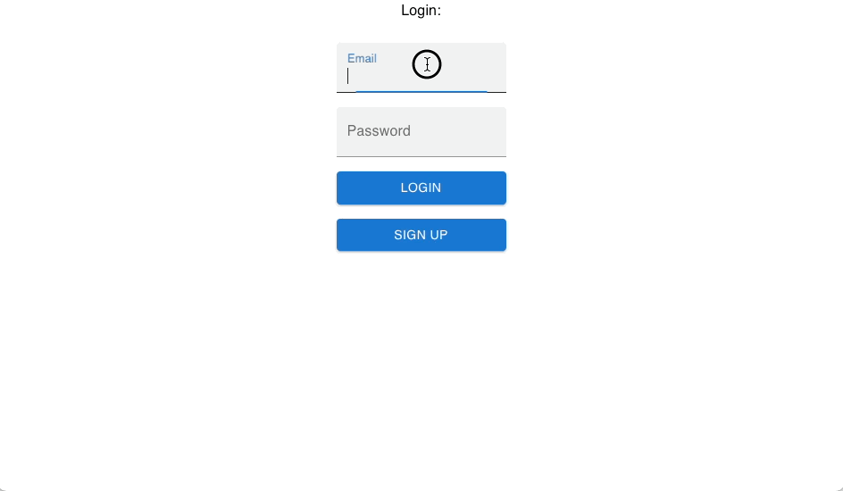

# Reminder App

Simple demo: Reminder App with features:
* User sign-up and login with email+password
* Create reminders with name and description
* Send email notification for each reminder

Build with:
* Spring Boot
* Lombok
* Quartz
* Spring Data JPA
* Postgres
* H2 for tests
* React
* MaterialUI

## Development

1. Run postgresql (``docker-compose up -d postgres``)
2. Prepare environment variables:
```
spring.datasource.url=jdbc:postgresql://localhost:5432/reminder
spring.datasource.username=postgres
spring.datasource.password=password # postgres password here
jwt.secret=test
reminder.notifications.email.smtp.host=smtp.yandex.ru # your SMTP host here
reminder.notifications.email.smtp.port=465
reminder.notifications.email.smtp.login=test@mail.ru # your email here
reminder.notifications.email.smtp.from=test@mail.ru # your email here
reminder.notifications.email.smtp.password=test@mail.ru # your email password here
```
3. Run [Main](./src/main/java/io/shuvalov/test/reminder/Main.java) either from IDE or gradle (``./gradlew bootRun``),
passing all the environment variables from the previous step.
4. Run frontend: invoke ``npm start`` in [frontend](./frontend) dir.
5. Go to [http://localhost:3000](http://localhost:3000)

## Tests

```
./gradlew  test
```

## Build and deployment with docker

1. Build frontend: ``npm install && npm run build``  in [frontend](./frontend) dir.
2. Build docker image: ``./gradlew  build docker -x test``
3. Prepare configuration file ``.env``:
```
SECURE_PASSWORD=
JWT_SECRET=
SMTP_HOST=
SMTP_PORT=
SMTP_LOGIN=
SMTP_PASSWORD=
```
, where 
* **SECURE_PASSWORD** - postgres password
* **JWT_SECRET** - secret for JWT auth
* **SMTP_HOST**, **SMTP_PORT**, **SMTP_LOGIN**, **SMTP_PASSWORD** - SMTP credentials for sending notifications (TLS v1.2 compatible)
4. Run application: ``docker compose up -d``
5. Go to [http://localhost:8080](http://localhost:8080)

## Demo


